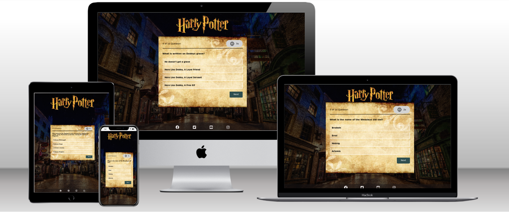
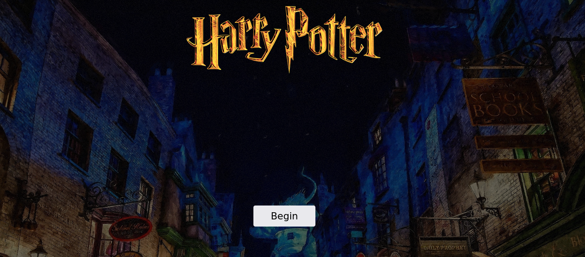
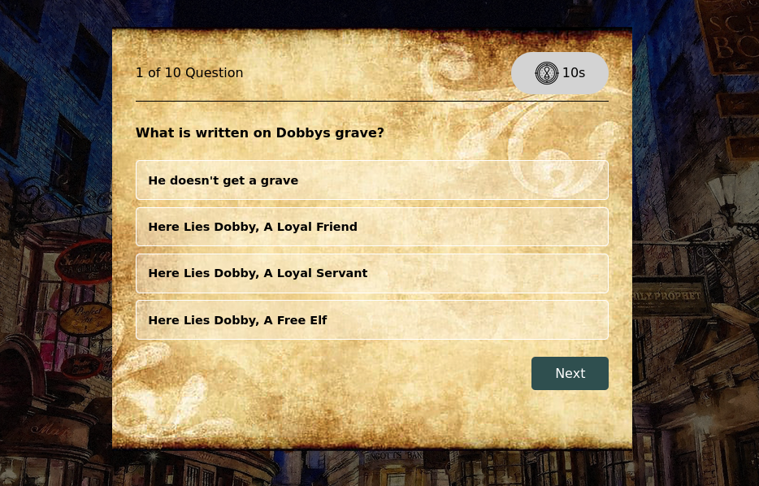
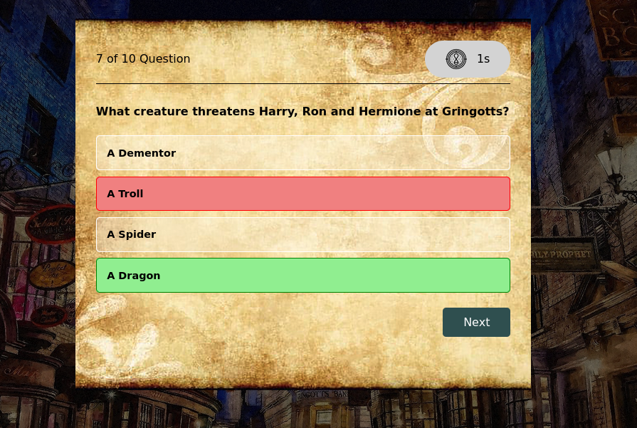
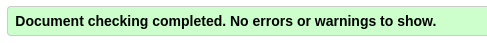
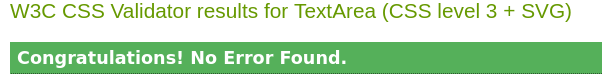
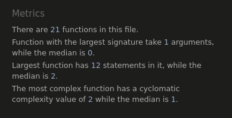

# Harry Potter Quiz

With the current release of Hogwarts Legacy i thought it was a fun way to continue the hype about the wonderful world of Harry Potter. A simple quiz to test the users knowledge.

##  Table of content
- [User Experience (UX)](#user-experience--ux-)
- [Technologies used](#technologies-used)
- [Features](#features)
- [Testing](#testing)
- [Deployment](#deployment)
- [Credits](#credits)

## User Experience (UX)
### User stories
#### Visitor goals
- The main goal is to let the user test their Harry Potter knowledge.
- The user should have good insight in the content when viewing the startpage.
- The user should have an easy accesible button to start the quiz.
- The user should receive direct feedback on wheter the answer is correct or not.
- The user should have the possiblity to restart the quiz and try to improve.

### Design 

The colourful background with the "old-school" pargment above gives the right mood for the  quiz, its Harry Potter and the design just feels like you're in this magical world full of wonders. 

1. Images

To support the topic of the quiz a background image of diagonally was choosen, then a pargment for the quizsection to get into the "Harry Potter" feeling.

2. Colour Scheme

Beacuse of the colourful background image the other parts of the design where kept simple. Beside the pragment the colour black where chosen for this. This also provide optimal accesibilty. 

3. Typography

The font chosen is Sans-serif. 

## Technologies used 
### languages
- CSS
- HTML
- Javascript

### Frameworks, Libraries & Programs Used
- [font awesome](https://fontawesome.com/): the icon of the snowflakes is from Font awesome
- Git: Git was use commit and push to github 
- [GitPod](https://gitpod.io/): Gitpod was used as the development environment for this project. In order to track development stage and version control regular commits and pushes to GitHub has been made. The GitPod environment was created using a template provided by Code Institute.
- [GitHub](https://github.com/): Github was used to deploy the site and store it  

## Features
### Instructions
The first visible elements when you load the page are the Harry Potter logo and the background image of Diagonally. A begin button is showing in the middle of the screen. 

### Questions
When the user press start you are presented with the question and four possible answers. 

### Questions with direct feedback 
When the user have chosen an answer you get instant feedback on which answers are correct (Green background on the option) or incorrect (Reb background on the choosen option and green on the correct option).

### Feedback en score
In this box the score is presented with a restart button incase the user want so try again.

## Testing 
## testing of the user story
### User stories

|Goal| execution|
|--------------------------------------------------------------------------------------|-------------------------------------------------------|
| The main goal is to let the user test their Harry Potter knowledge.| The Quiz lets them test their knowledge and restart if they want to try and improve.|
| The user should have good insight in the content when viewing the startpage.| The backgroundimage and the logo gives the user a clear sight of wwhat the quiz will be about|
| The user should have an easy accesible button to start the quiz.| The beginbutton is clear an easily visable.|
| The user should receive direct feedback on whether the answer is correct or not.| A clear red and green color is used for the user to easily see which option was correct.|
| The user should have the possiblity to restart the quiz and try to improve.| When the quiz finishes the user gets a clear Restartbutton if they wanna try again.|
## manual code testing
### responsiveness
The website is adapted to be seen on different screen sizes. 
The responsiveness of the website was first tested by chrome developer tools. 
Different breakpoints where used to view the website. 
Next to this the website was viewed on different devices: laptop, tablet and smartphones. 

### Browser compatibility 
The website was tested in different browsers. 

|Browser| compatibility|
|------------------------------------|-------------|
|Mozilla Firefox versie 102.0|no problems|
|Microsoft Edge Versie 103.0.1264.44|no problems|
|Google Chrome Versie 103.0.5060.114 | no problems|

### Validator Testing 
1. HTML
No errors where found by the official W3C validator

2. CSS
No errors where found by the official Jigsaw validator

3. JSHint 
No errors where found by the official JSHint validator

### Fixed bugs 
- Footer misplaced, Fixed by adding position: absolute; and set bottom: 0.
- Logo image got very small on smaller screens, Fixed by setting new widthsizes in mediequeries.
- DisplayNext function not properly working, Fixed by extrating the function from local scope to global scope.

### Unfixed bugs
- The timer takes an extra second to start the countdown. 
- pathlenght attribute on rect tag was not allowed in HTML linter.

## Deployment 
The live version of the project is deployed at GitHub pages.

The procedure for deployment followed the "Creating your site" steps provided in [GitHub Docs.](https://docs.github.com/en/pages/getting-started-with-github-pages/creating-a-github-pages-site)

1. Log into GitHub.
2. Locate the GitHub Repository that shall be deployed live.
3. At the top of the repository, select Settings from the menu items.
4. Scroll down the Settings page to the ”GitHub Pages" section and click on the ”Check it out here!”
5. At the ”Source” section choose ”main” as Branch and root as folder and click ”Save”
6. The website will deploy and the pages refreshes to provide the live link to the project.

The link can be found here: https://haniibani.github.io/Pp2/

## Credits

### Images
- All images were taken from: [Pngegg](https://www.pngegg.com/)

### code 
- The basic code used was taken from a [youtube tutorial from Dear Programmer](https://www.youtube.com/watch?v=WiLTsxjCmWQ&ab_channel=DearProgrammer) with a bunch of alterations.
- Code for the glowing animation around the begin button from [youtube tutorial from Kevin Powell](https://www.youtube.com/watch?v=fcnDBP3k3BE&ab_channel=KevinPowell)
- On the website of the [w3schools](https://www.w3schools.com/) I found a lot of information and codes for bugs and small changes to make.
- Varies parts of the website were inspired by the love math walkthrough project from Code institute 

### others
- Question about lowest Harry Potter [World of Harry Potter Trivial Pursuit](https://hasbropulse.com/products/trivial-pursuit-world-of-harry-potter-ultimate-edition)
- [Mock-up generator](https://techsini.com/multi-mockup/)
- Martina Terlevic:  Code Institute Mentor.